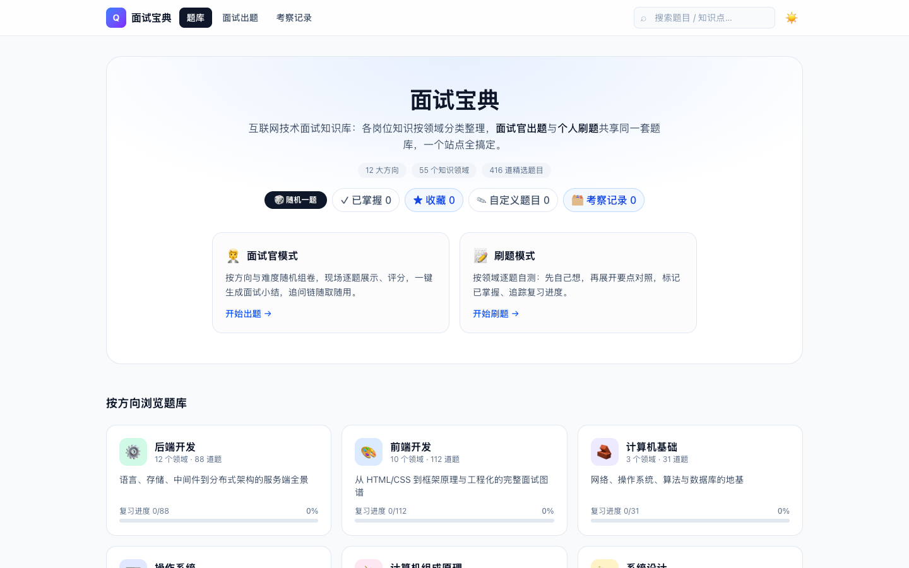
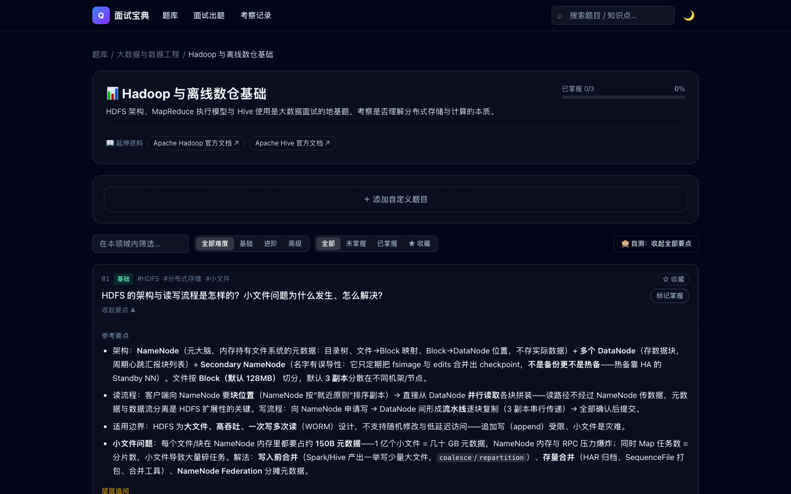

# 面试宝典 · interview.xwzy.dev

线上地址：<https://interview.xwzy.dev/>（生产，自定义域名已启用）· <https://interview-xwzy-dev.pages.dev/>（Pages 预览域）

互联网技术面试知识库（纯前端站点）：把各岗位的面试知识按方向 → 领域 → 题目三层组织好，
**面试官出题** 与 **个人刷题** 共享同一套题库。

| 首页（浅色） | 领域刷题页（深色） |
| --- | --- |
|  |  |

## 功能

- **两种模式，一套题库**
  - 🧑‍💼 **面试官模式**（`/quiz`）：填写候选人标识、勾选考察方向与难度（可选**由易到难**递进、**只抽收藏题**、**只抽未掌握**），随机抽题组卷；逐题展示（先题目、后要点，可收起），每题带参考要点与**层层递进的追问链**、**现场计时**，支持**评分（通过 / 不通过 / 待定）**与**回答备注**，键盘快捷操作（空格展示要点、1/2/3 评分、← → 切题）；**误刷新一键恢复现场**；结束后自动存档并生成**可一键复制的面试小结**（含每题用时与总用时）。
  - 📝 **刷题模式**（题库页）：按领域自测，支持关键词/难度/掌握状态筛选、一键展开或收起全部要点、标记"已掌握"，进度保存在浏览器 localStorage。
- **自定义题目**：在任意领域下新增/编辑/删除自己的题目（题干、难度、标签、要点、追问），实时生效于刷题、面试出题、搜索与进度统计，并随备份导出/导入。
- **收藏夹**：星标重点题目，刷题可按「★ 收藏」筛选，面试出题可勾选**只抽收藏题**做定向考察。
- **考察记录**（`/history`）：历次出卷存档（候选人、评分、备注），可随时回看整卷、再次复制小结、删除记录。
- **数据管理**（`/settings`）：刷题进度、评分、考察记录与自定义题目的导出备份 / 导入恢复 / 分类清空；支持把整站题库（含自定义题目）**一键导出为 Markdown 文档**，方便打印或导入笔记工具。
- **十二大数据方向**：后端开发、前端开发、计算机基础、**操作系统**、**计算机组成原理**、系统设计、**大数据与数据工程**、移动端、AI 与大模型、**测试与质量**、**运维与云原生**、职业发展。
- **深度追问链**：全站 511 题中 98% 配有层层递进的追问链（共 726 步），追问自带参考要点，按"原理 → 边界场景 → 方案权衡"展开；追问内容已纳入全局搜索。
- **首页随机一题**：一键从全站题库抽题直达，适合碎片时间背题。
- **全局搜索**（`/search`）：跨方向检索题目、要点、追问与标签；支持「☆ 只看收藏」过滤与关键词高亮。
- **三态主题**：默认**深色**，可切浅色 / 跟随系统（OS 切换实时联动），选择持久化。
- **PWA**：可安装到桌面/手机主屏，Service Worker（网络优先 + 离线回退 + 容量修剪）让已访问页面在断网时仍可刷题。
- **暗色模式**、响应式布局、纯静态部署（无后端、无账号体系）。

## 技术栈

Vite 7 · React 19 · TypeScript（strict）· Tailwind CSS 4 · React Router 7 · react-markdown

## 本地开发

```bash
npm install
npm run dev       # 开发服务器
npm run build     # 类型检查 + 产物构建（tsc -b && vite build）
npm run lint      # ESLint
npm test          # Vitest 单元测试（含题库内容完整性校验）
npm run preview   # 预览构建产物
```

## 部署

站点已部署至 **Cloudflare Pages**：生产地址 https://interview.xwzy.dev（自定义域名已激活），
预览地址 https://interview-xwzy-dev.pages.dev/（每次部署生成唯一预览 URL）

### 常规更新部署（三步）

```bash
npm run verify                                          # 1. 质量门禁：lint + test + build（dist 已生成并自检）
git add -A && git commit && git push                    # 2. 提交推送（触发 GitHub CI 跑同样的校验）
npx wrangler pages deploy dist --project-name=interview-xwzy-dev --branch=main   # 3. 更新线上
```

部署完成后等 1~2 分钟生效，访问 https://interview.xwzy.dev 验证（浏览器强刷 Cmd+Shift+R；
PWA 有 Service Worker 缓存，旧缓存会在新版次访问时后台更新）。

### 部署机制说明

- **部署通道**：wrangler 直传 `dist`（Direct Upload），**不与 GitHub 集成自动部署**——push 只触发
  CI 质量门禁（`.github/workflows/ci.yml`：lint → test → build），线上更新必须手动执行第 3 步。
- **首次配置**（新环境）：`npx wrangler login` 授权后 `npx wrangler pages project create interview-xwzy-dev --production-branch=main`，再执行常规三步。
- **构建产物**：`npm run build` = `tsc -b && vite build && node scripts/check-dist.mjs`，check-dist 会校验
  资源引用与 PWA 文件完整性，构建失败时不会产出可部署的 dist——**永远部署 verify/build 通过的产物**。
- **自定义域名**：Pages 项目 → Custom domains → 激活 `interview.xwzy.dev`（同账号 zone 自动创建 DNS 与证书）。
- **SPA 说明**：Cloudflare Pages 在无 `404.html` 时自动以 `index.html` 兜底未命中路径，深链直接可用。
- **回滚**：Cloudflare 控制台 → Workers & Pages → interview-xwzy-dev → Deployments，任意历史部署可一键
  Rollback（也可以用 `npx wrangler pages deployment list` 查看）；代码级回滚则 git revert 后重新走三步。

## 如何补充题库

所有题目都是纯数据，在 `src/data/` 下按方向一个文件：

1. 新建 `src/data/your-track.ts`，导出一个 `Track` 对象（类型见 `src/types.ts`），题目 id 使用统一前缀（如 `be-`、`fe-`）。
2. 在 `src/data/trackLoaders.ts` 中注册加载器，并在 `src/data/content.test.ts` 的 `allowedPrefixes` 里登记方向前缀。
3. 题目结构：

```ts
{
  id: 'be-mysql-mvcc',            // 全局唯一，kebab-case
  title: 'MySQL InnoDB 的 MVCC 是如何实现的？',
  difficulty: 'intermediate',     // basic | intermediate | advanced
  tags: ['MySQL', 'MVCC'],
  points: ['**要点**：markdown 字符串…'],   // 参考要点
  followUps: [                    // 追问链（可选，层层递进）
    {
      question: 'RR 隔离级别下 MVCC 能完全避免幻读吗？',
      points: ['追问的参考要点…'],
    },
  ],
}
```

内容约定：要点要具体、可背诵、关键术语加粗；追问按"原理 → 边界 → 权衡"递进；
`references` 只放确定真实存在的官方文档链接。
**跨方向不重复**：同一主题不允许在多个方向各写一道"差不多"的题——要么只保留一处，要么明确分工视角
（如 epoll：操作系统方向讲内核机制、后端方向讲 Reactor 应用模型），互相在正文注明分工。

内容质量由自动化测试守护（`npm test`）：题目 id 全站唯一且符合方向前缀、**题目标题跨方向查重**、每题必有非空要点、
延伸资料必须 https、领域内按 基础→进阶→高级 自动排序——脏数据会被 CI 直接拦下。

## 性能

- 首屏主包约 90KB（gzip），不含任何题目内容；题库按方向拆成 12 个分包，异步加载
- 页面级代码分割（React.lazy），PWA Service Worker 缓存后二次访问与离线场景秒开

## 目录结构

```
src/
├── components/    # Layout、题目卡片、追问链、搜索框等组件
├── context/       # 主题 / 掌握进度 / 题目评分 / 考察记录（localStorage）
├── data/          # 题库（每方向一个文件）+ 索引
├── lib/           # 工具函数、配色、面试小结构建器
├── pages/         # 首页 / 方向页 / 领域刷题页 / 面试官出题页 / 搜索页 / 考察记录 / 数据管理
└── types.ts       # Track / Topic / Question 类型
```
